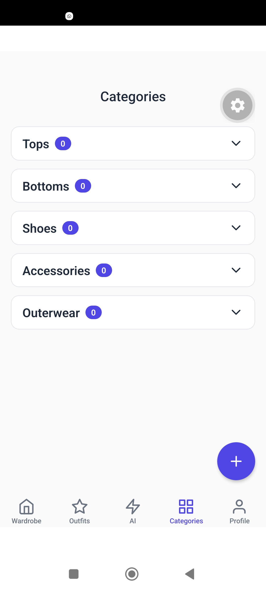

# 👗 Virtual Wardrobe Manager

A React Native mobile application for organizing a personal wardrobe, managing clothing items, creating outfits, and generating ranked outfit recommendations from wardrobe metadata.

## ✨ Features

- 📸 Add clothing items using the camera or photo gallery
- 👕 Organize clothing by category: Tops, Bottoms, Shoes, Accessories, and Outerwear
- 🎨 Store clothing colors
- 🌤 Track seasons: Spring, Summer, Fall, and Winter
- 🏢 Track occasions: Casual, Work, Formal, and Sport
- 👗 Generate outfit combinations from available wardrobe items
- ✨ Generate ranked outfit recommendations with a rule-based scoring engine
- 📊 View recommendation scores and contributing factors
- 💾 Persist wardrobe and outfit data locally with AsyncStorage
- 🖼 Persist selected clothing images locally with Expo File System
- 🌙 Support light and dark themes
- 🧹 Clear stored wardrobe and outfit data from the profile screen

## 🧠 Recommendation Engine

The recommendation system is **rule-based**; it does not use a trained machine-learning model.

It evaluates possible combinations using four weighted factors:

| Factor | Weight |
|---|---:|
| Category completeness | 40% |
| Season compatibility | 25% |
| Occasion compatibility | 20% |
| Color compatibility | 15% |

The engine generates combinations from available tops and bottoms and evaluates available shoes and accessories. Each combination receives a score from 0–100 and is ranked before the top recommendations are returned.

The score breakdown is also exposed to the UI so users can see why an outfit received its score.

## 🛠 Tech Stack

- **React Native 0.86** — Mobile application framework
- **Expo SDK 57** — Development and build platform
- **TypeScript** — Type-safe application development
- **React Navigation 7** — Stack and bottom-tab navigation
- **AsyncStorage** — Local persistence
- **Expo Image Picker** — Camera and gallery access
- **Expo File System** — Local image file management
- **Expo Image** — Image rendering
- **React Native Reanimated** — Animations
- **React Native Gesture Handler** — Gesture support

## 📱 Screenshots

### My Wardrobe


### Outfit Ideas


### AI Outfit Suggestions


### Categories



### Profile


## 🏗 Architecture

```text
App
 │
 └── RootStackNavigator
      │
      └── MainTabNavigator
           ├── Wardrobe
           ├── Outfits
           ├── AI Suggestions
           ├── Categories
           └── Profile
                │
                └── WardrobeContext
                     │
                     └── Storage Utilities
                          ├── AsyncStorage
                          └── Expo File System

Recommendation flow

Wardrobe Items
      │
      ├── Category compatibility
      ├── Season compatibility
      ├── Occasion compatibility
      └── Color compatibility
               │
               ▼
        Weighted Score
               │
               ▼
     Ranked Recommendations
```

## 📂 Project Structure

```text
ai-wardrobe/
│
├── assets/
│   └── images/              # App icons, splash assets, and empty states
├── components/              # Reusable UI components
├── constants/               # Theme and shared constants
├── contexts/                # Global wardrobe state
├── docs/
│   └── screenshots/         # README screenshots
├── hooks/                   # Reusable React hooks
├── navigation/              # Tab and stack navigators
├── screens/                 # Application screens and modals
├── services/                # Outfit generation and recommendation logic
├── types/                   # TypeScript data models
├── utils/                   # Local storage utilities
│
├── App.tsx
├── app.json
├── eslint.config.js
├── package.json
├── package-lock.json
├── tsconfig.json
├── LICENSE
└── README.md
```

## 🚀 Getting Started

### Prerequisites

- Node.js
- npm
- Expo-compatible Android/iOS device or emulator

### Installation

```bash
git clone <https://github.com/Aqsahmed18/virtual_wardrobe_manager.git>
npm install
npm start
```

Then use the Expo development server to open the application on your preferred platform.

For camera and gallery functionality, use a physical device or an Android/iOS emulator with the required permissions.

## 🔍 Development Checks

Run both TypeScript and ESLint checks:

```bash
npm run check
```

Or individually:

```bash
npm run typecheck
npm run lint
```

## 💾 Data Storage

The current version is local-first and does not require a backend server or external database.

- **AsyncStorage** stores clothing metadata and saved outfits.
- **Expo File System** stores copied clothing image files locally.
- **WardrobeContext** provides application-wide wardrobe state.

## 📋 Current Limitations

- Recommendations are rule-based rather than machine-learning based.
- Clothing images are stored locally on the device.
- There is no account system or cloud synchronization.
- The application currently depends on manually entered clothing metadata for recommendation factors.

## 📌 Future Improvements

- Add search and filtering
- Improve wardrobe statistics
- Add more sophisticated color compatibility
- Add outfit explanation and reasoning improvements
- Add automated test coverage
- Add continuous integration with GitHub Actions
- Add optional cloud synchronization

## 📄 License

This project is licensed under the MIT License. See [LICENSE](LICENSE) for details.
